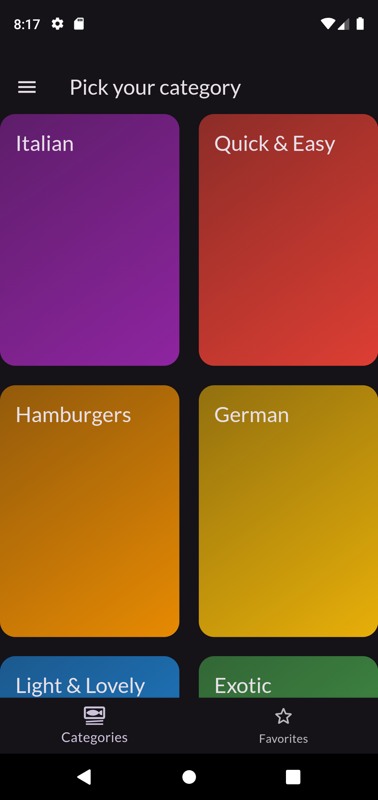
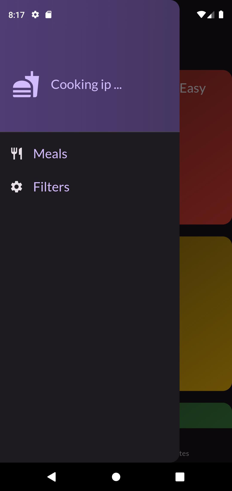
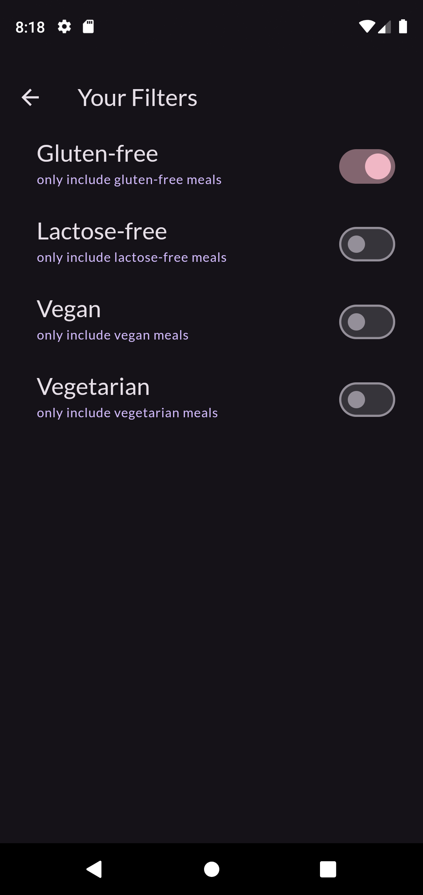
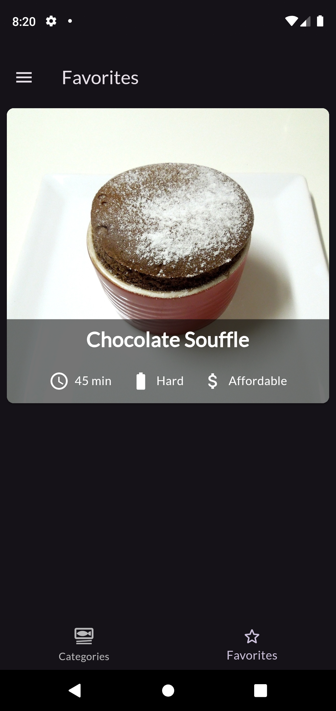
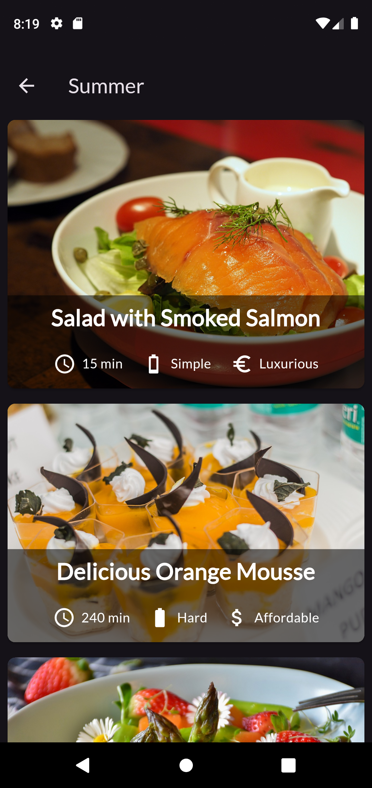
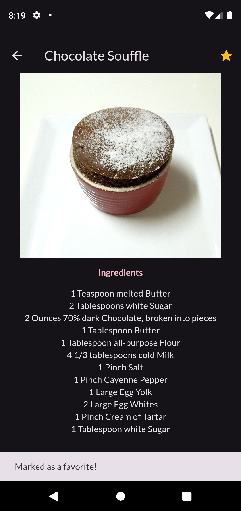

# MealApp  
## Meals Menu App 🥗 🍽 🍹🦞

This application displays a **meals menu** and provides two main features:

### 1. Filter Meals  
Users can filter meals based on the following categories:
- **Gluten Free**
- **Lactose Free**
- **Vegan**
- **Vegetarian**

### 2. Favorite Meals  
Users can mark meals as their **favorites**, and those meals will be saved and easily accessible on a dedicated **Favorites Page**.

---

### ScreenShots:

#### 1. Home Screen

A view of the app's home screen displaying a list of meals with filtering options and navigation.

#### 2. Drawer Menu

The app's drawer includes two options:
- **Meals**: Navigates to the meals menu where users can browse through all available meals.
- **Filter**: Allows users to filter meals by different categories such as Gluten-Free, Lactose-Free, Vegan, and Vegetarian.

#### 3. Favorite Meals

Users can mark meals as favorites and view them on the favorites page.

#### 4. Meals List

The view displays a list of meals, with each item showcasing its preparation duration, complexity level, and affordability

#### 5. Meal Details

The detailed view of a selected meal, including the image, ingredients, and instructions.

---

### Packages:
- **flutter_riverpod:**  
  Riverpod is used to manage the application's state and provides a predictable way to handle changes such as filtering meals and managing favorite meals. Implemented in favorite meals, filter meals based on category, meals data, and the navigation bar. 
  
- **google_fonts:**  
  This package allows you to use fonts from Google Fonts in your Flutter app easily. It supports fetching and using fonts dynamically and ensures that text looks great with minimal effort by avoiding manual font asset management.

- **transparent_image:**  
  Used to display each meal's image URL with a transparent placeholder, ensuring a smooth transition while the images are being loaded.

---

#### Getting Started

This project is a starting point for a Flutter application.

A few resources to get you started if this is your first Flutter project:

- [Lab: Write your first Flutter app](https://docs.flutter.dev/get-started/codelab)
- [Cookbook: Useful Flutter samples](https://docs.flutter.dev/cookbook)

For help getting started with Flutter development, view the
[online documentation](https://docs.flutter.dev/), which offers tutorials,
samples, guidance on mobile development, and a full API reference.
